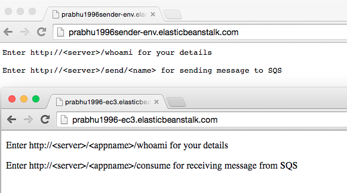
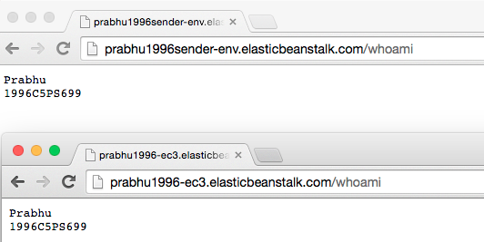
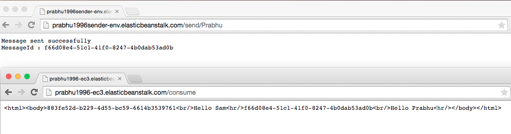

= Code for ECIII

[abstract]
Read the instructions carefully.

== Application A; (Sender); Node JS

* Code for Sender is available in _Sender_ folder
* Make changes to the following files only

----
aws.credentials.json +
whoami.txt +
sqsendpointdetails.txt
----

* _aws.credentials.json_ will contain your accesskey, secretid and the region
* _region_ specifies the code of the region where you have configured SQS queue. For example if you have configured it in _Oregon_, the region will be *us-west-2*.
 
* _whoami.txt_ will have your name and BITS idnumber
* _sqsendpointdetails.txt_ will have the complete URL of the SQS endpoint.

== Application B; (Receiver); Java WEB

* Code for Receiver is available in _Receiver_ folder
* Make changes to the following files only

----
AWSCredentials.properties +
whoami.txt +
web.xml
----

* _AWSCredentials.properties_ present in _src_ folder will contain your accesskey and secretid.
* _whoami.txt_ present in _WebContent_ folder will have your name and BITS idnumber
* _web.xml_ present in _WebContent/WEB-INF_ folder will have the following configuration.

[source,xml]
----
 <servlet>
    <description></description>
    <display-name>ReceiverServlet</display-name>
    <servlet-name>ReceiverServlet</servlet-name>
    <servlet-class>com.eciii.ReceiverServlet</servlet-class>
    <init-param>
        <param-name>SQSDetailsEndPoint</param-name>
        <param-value>YOUR SQS ENDPOINT GOES HERE</param-value>
    </init-param>
  </servlet>
----
* You need to replace _YOUR SQS ENDPOINT GOES HERE_ in _<param-value>_ element with your SQS Endpoint.

== Sample Screen shots after SQS is configured and applications are deployed in EB

*  *Please ignore some minor formatting issues.*

=== Initial screens
 +

===  Running whoami

 +

=== The send-receive operation
 +

